# 云音乐

在 Home Assistant 里使用的云音乐插件

[](https://www.home-assistant.io/)
[](https://github.com/hacs/integration)


> 🙏 本项目基于 [shaonianzhentan/ha_cloud_music](https://github.com/shaonianzhentan/ha_cloud_music) 开发，感谢原作者的开源贡献！

---

## 安装

安装完成重启 HA，刷新一下页面，在集成里搜索 `云音乐`

[](https://my.home-assistant.io/redirect/config_flow_start?domain=ha_ncloud_music)

> 接口说明

接口服务是开源免费的，但需要自己进行部署，然后持续进行更新升级，如果遇到接口相关的问题，请去`NeteaseCloudMusicApiEnhanced`项目中查找问题

https://github.com/neteasecloudmusicapienhanced/api-enhanced

**注意：关联媒体播放器调整为在集成选项中选择**

---

## 🌐 歌词全屏播放器

独立的全屏歌词网页播放器，支持逐字歌词、毛玻璃背景、歌词偏移：

👉 **[ha_ncloud_music_web](https://github.com/neqq3/ha_ncloud_music_web)**

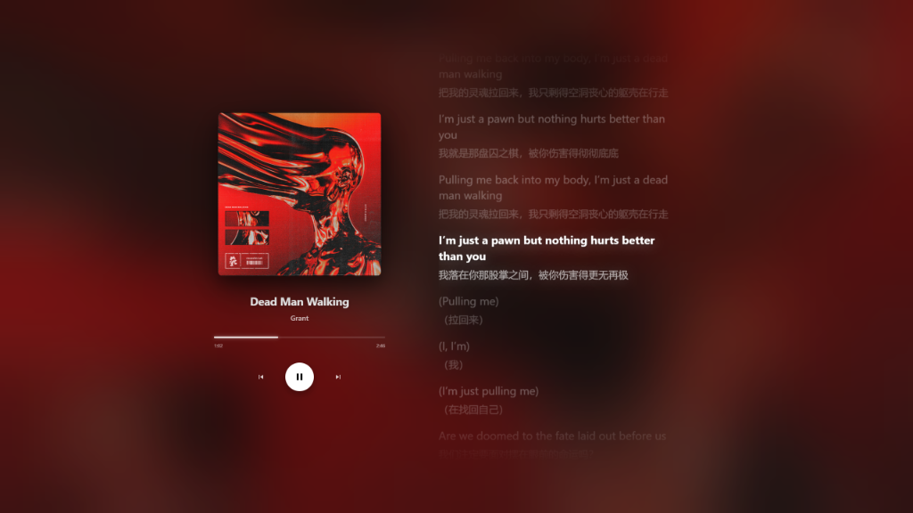 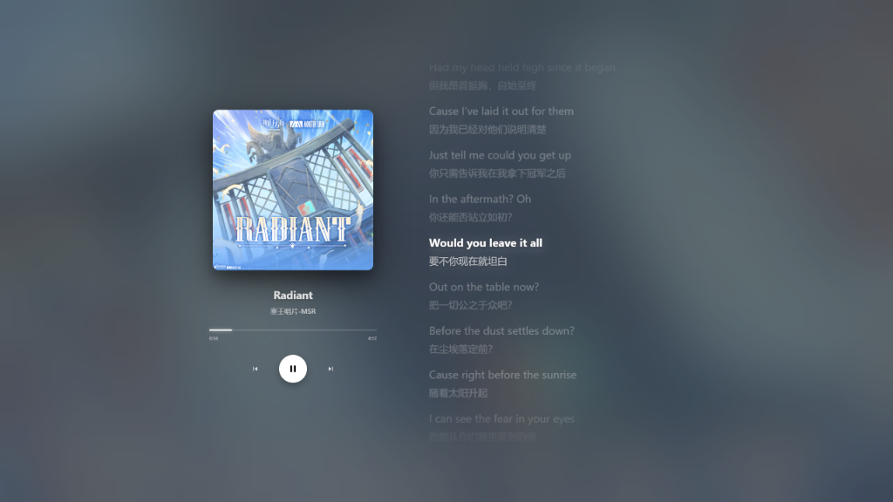

## 📚 媒体浏览器

通过媒体浏览器可访问：搜索结果、播放列表、每日推荐、我的歌单、我的电台等。

| 媒体浏览器首页 | 可视化搜索结果 | 歌单详情 |
|:---:|:---:|:---:|
| 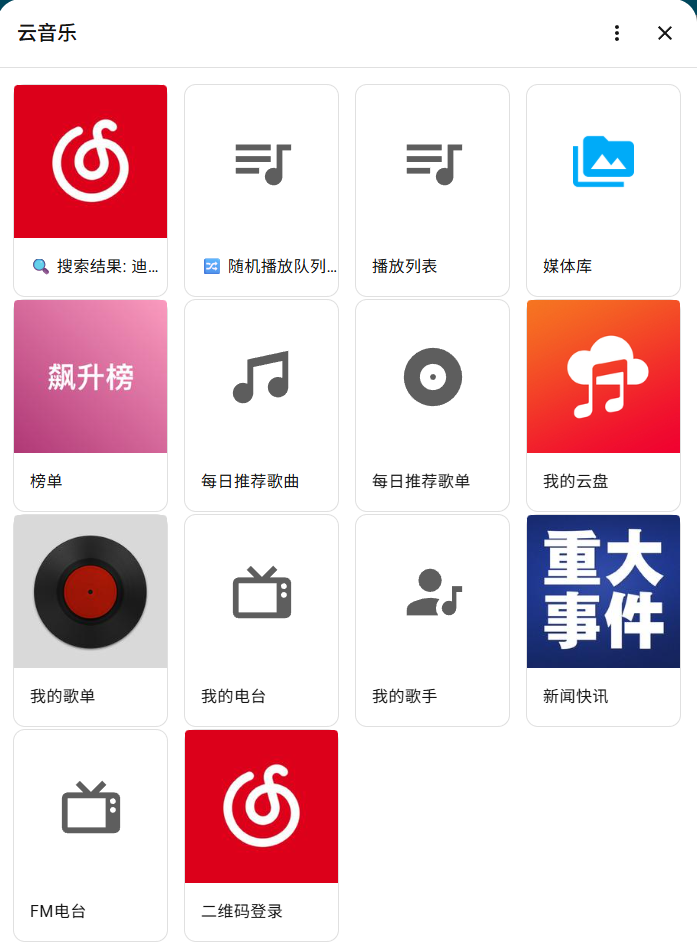 | 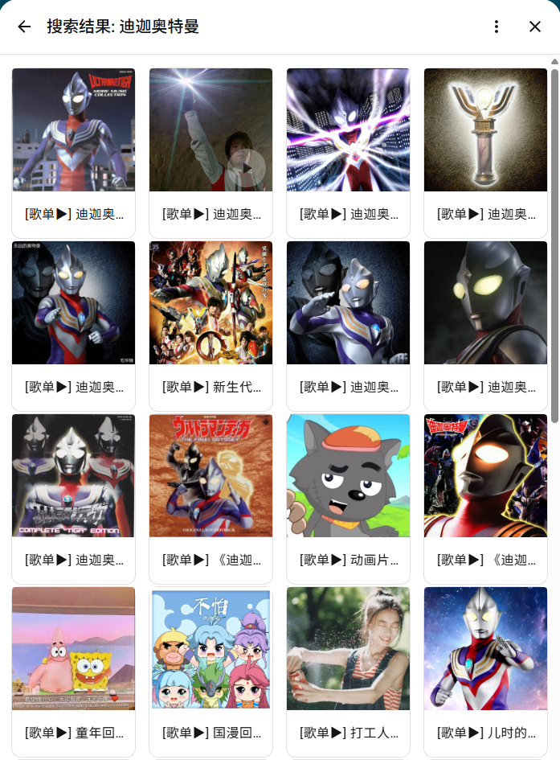 | 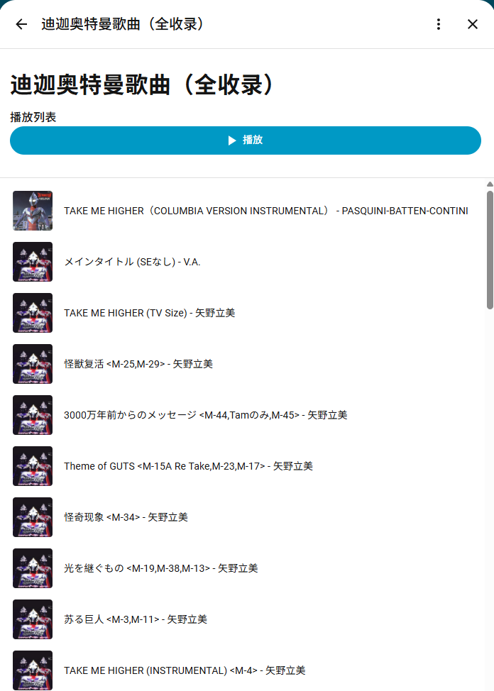 |

搜索结果也可在 Dashboard 的下拉框中选择播放：

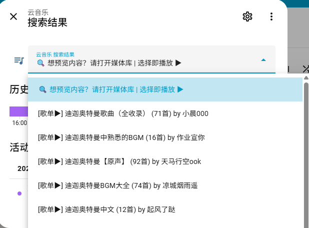


## 🎛️ Dashboard 实体

本插件自动创建以下实体，可直接添加到 Dashboard：

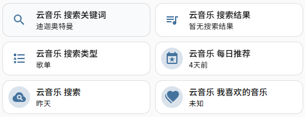 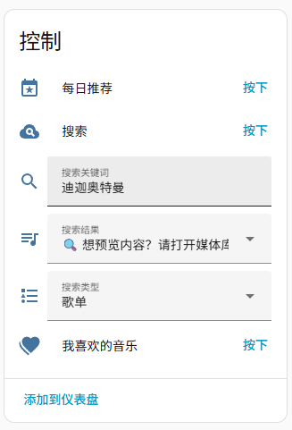

## 🎲 真随机播放

开启随机模式后，歌单会被预先打乱成固定的随机顺序：

- **智能洗牌**：播完一轮后自动重新洗牌，且保证上轮末尾歌曲不会出现在新一轮开头
- **随机队列可视化**：可在媒体浏览器中查看「随机播放队列」

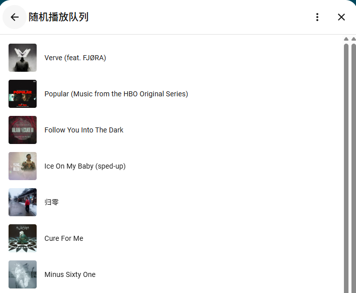

## ⏱️ 智能切歌

在集成选项中可配置「切歌时机」（单位：秒）：

| 值 | 效果 |
|---|---|
| **正值**（如 `3`） | 延迟切歌。系统等待设定秒数，若底层播放器提前报告结束则立即切歌 |
| **负值**（如 `-2`） | 提前切歌。在歌曲结束前 N 秒切换下一首（适合实现无缝过渡） |
| **0** | 歌曲播完立即切歌 |

> 💡 **智能抢断**：设置正值时，若底层播放器在等待期内主动报告结束，系统会提前触发切歌，避免卡顿。

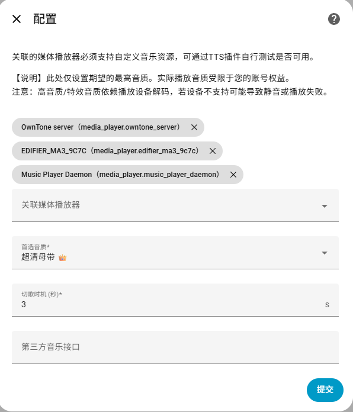

## 使用

> **指定ID播放**

- 播放网易云音乐歌单 `cloudmusic://163/playlist?id=25724904`
- 播放网易云音乐电台 `cloudmusic://163/radio/playlist?id=1008`
- 播放网易云音乐歌手 `cloudmusic://163/artist/playlist?id=2116`
- 播放喜马拉雅专辑 `cloudmusic://xmly/playlist?id=258244`

> **搜索播放**

- [x] 音乐搜索播放 `cloudmusic://play/song?kv=关键词`
- [x] 歌手搜索播放 `cloudmusic://play/singer?kv=关键词`
- [x] 歌单搜索播放 `cloudmusic://play/list?kv=关键词`
- [x] 电台搜索播放 `cloudmusic://play/radio?kv=关键词`
- [x] 喜马拉雅搜索播放 `cloudmusic://play/xmly?kv=关键词`
- [ ] FM搜索播放 `cloudmusic://play/fm?kv=关键词`
- [x] （不推荐）第三方音乐搜索播放 `cloudmusic://search/play?kv=关键词`

> **登录后播放**
- [x] 每日推荐 `cloudmusic://163/my/daily`
- [x] 我喜欢的音乐 `cloudmusic://163/my/ilike`

## ⚙️ 音质配置

在集成选项中可配置首选音质，支持从标准到超清母带的多种选择：

> ⚠️ **注意**：此处仅设置期望的最高音质，实际播放音质受限于您的权益。高音质/特效音质依赖播放设备解码，若设备不支持可能导致静音或播放失败。

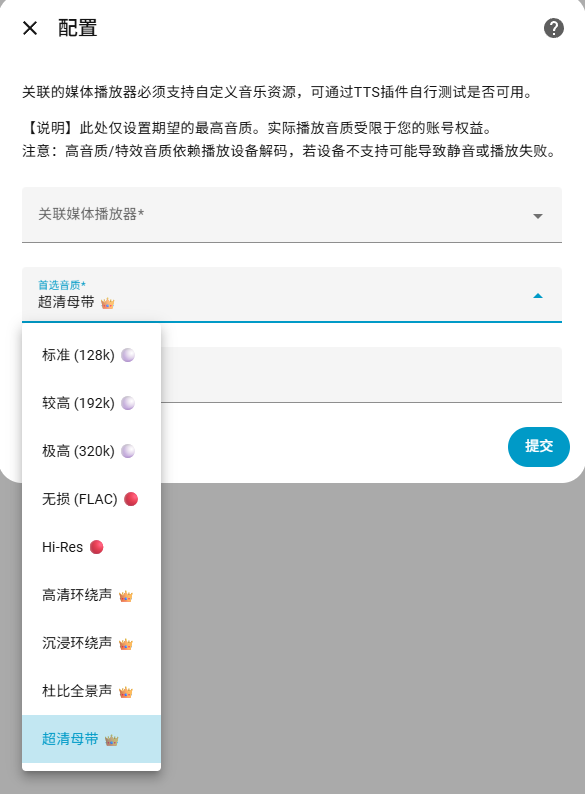

## 🤖 服务调用（自动化 / AI 语音）

本插件提供以下服务，可用于自动化或 AI 语音助手调用：

| 服务 | 说明 | 示例 |
|------|------|------|
| `ha_ncloud_music.search` | 搜索并播放音乐、歌手、歌单或电台 | 关键词：`迪迦奥特曼` |
| `ha_ncloud_music.play_by_id` | 通过 ID 精准播放歌曲、歌单、专辑或电台 | ID：`25724904` |
| `ha_ncloud_music.play_daily` | 播放每日推荐歌单 | - |
| `ha_ncloud_music.play_favorites` | 播放"我喜欢的音乐" | - |

> 💡 **提示**：支持组合搜索，输入 `歌手名 歌曲名` 可提高匹配准确度。

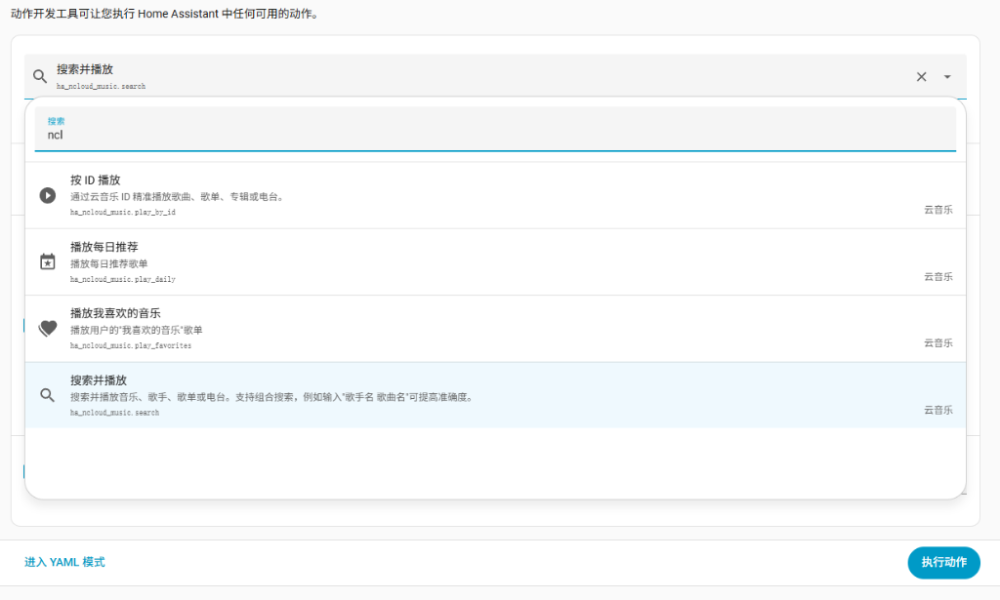 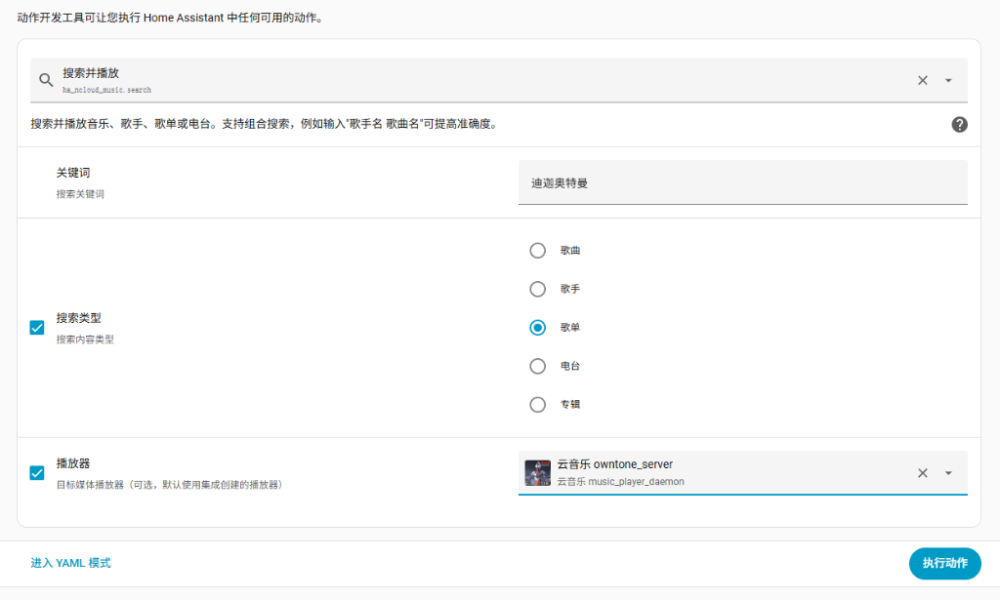

<details>
<summary>📝 搜索服务示例 YAML</summary>

```yaml
service: ha_ncloud_music.search
data:
  keyword: "奇迹再现 毛华峰"
  type: song  # 可选：song, artist, playlist, djradio, album
```
</details>

## 🎵 歌词卡片

歌词卡片已独立为单独项目，请访问：[ha_ncloud_music_card](https://github.com/neqq3/ha_ncloud_music_card)

## 关联项目

- https://github.com/shaonianzhentan/cloud_music_mpd
- https://github.com/shaonianzhentan/ha_windows

#### 关注shaonianzhentan的微信订阅号，了解更多HomeAssistant相关知识